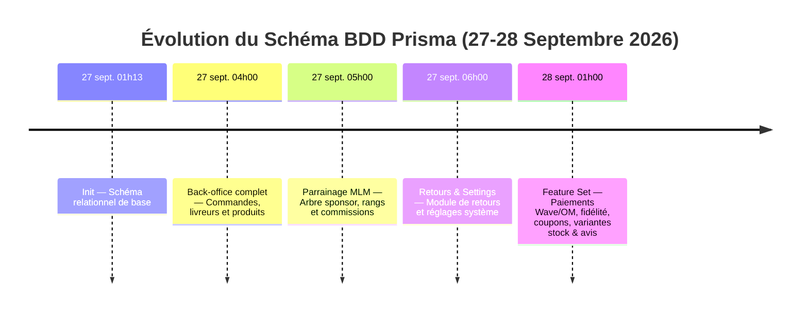
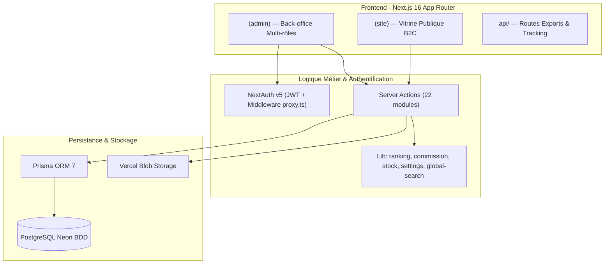
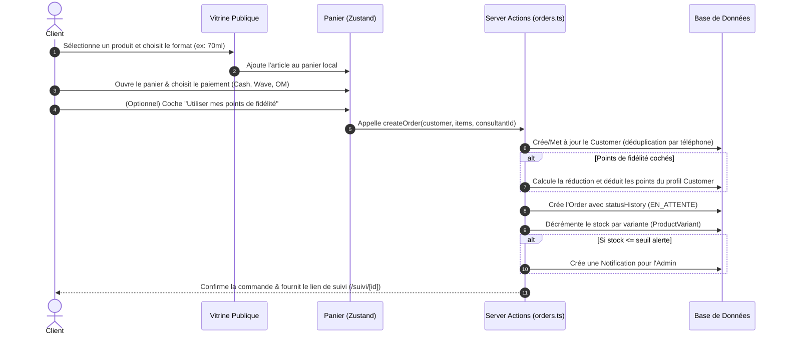
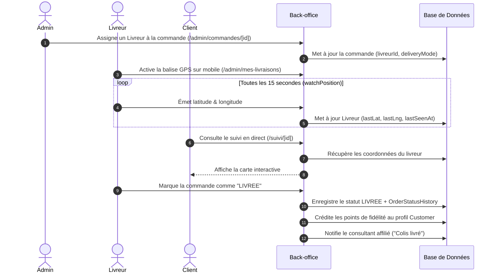
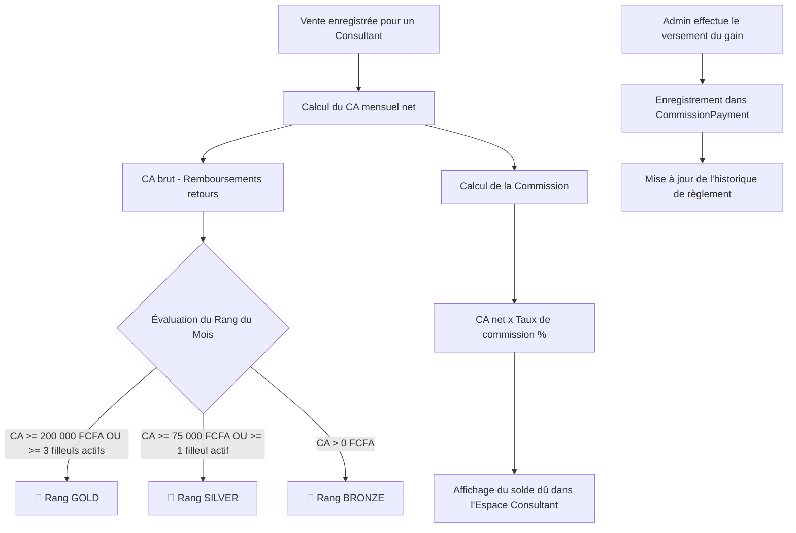
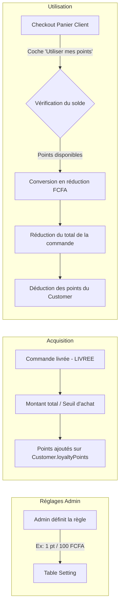
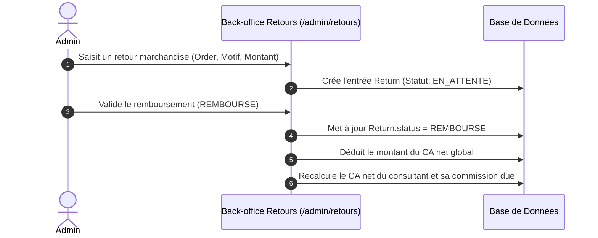
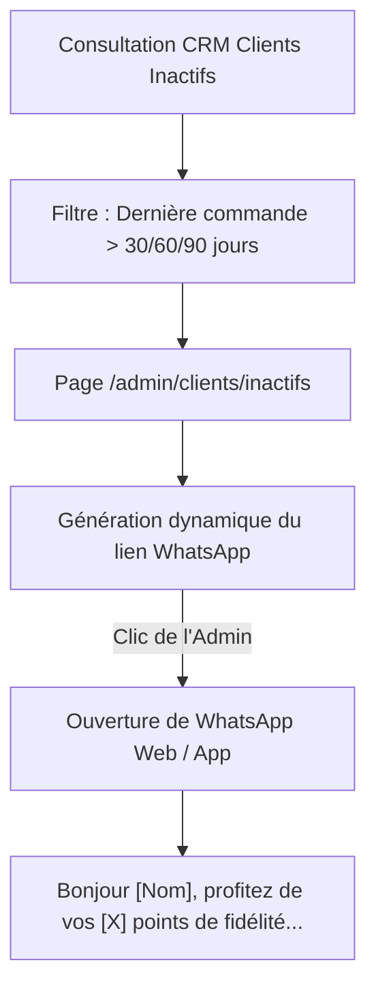

# 📕 DOCUMENT MAÎTRE UNIFIÉ : ANALYSE, WORKFLOWS & SPÉCIFICATIONS TECHNIQUES
## JAMAAL Luxury Cosmetics — E-Commerce, Réseau MLM & Flotte Logistique

---

## 📑 Table des Matières
1. [Présentation Générale & Vision Produit](#1-présentation-générale--vision-produit)
2. [Audit Technique, Métriques & Sécurité](#2-audit-technique-métriques--sécurité)
   - [2.1 Stack Technique](#21-stack-technique)
   - [2.2 Métriques du Codebase](#22-métriques-du-codebase)
   - [2.3 Audit de Sécurité & Recommandations Crises](#23-audit-de-sécurité--recommandations-crises)
   - [2.4 Chronologie de Développement](#24-chronologie-de-développement)
   - [2.5 Pipeline Catalogue & Table d'Équivalences Olfactives](#25-pipeline-catalogue--table-déquivalences-olfactives)
3. [Architecture Système & Matrice des Rôles (RBAC)](#3-architecture-système--matrice-des-rôles-rbac)
4. [Inventaire Exhaustif des Fonctionnalités par Espace](#4-inventaire-exhaustif-des-fonctionnalités-par-espace)
   - [4.1 Boutique Publique B2C](#41-boutique-publique-b2c)
   - [4.2 Back-Office Administrateur](#42-back-office-administrateur)
   - [4.3 Espace Revendeur / Consultant (MLM)](#43-espace-revendeur--consultant-mlm)
   - [4.4 Espace Livreur & Flotte Logistique](#44-espace-livreur--flotte-logistique)
5. [Cartographie des 6 Workflows Métier (Diagrammes Mermaid)](#5-cartographie-des-6-workflows-métier)
   - [Workflow 1 : Tunnel d'Achat Client & Paiements](#workflow-1--tunnel-dachat-client--paiements)
   - [Workflow 2 : Logistique & Suivi GPS Temps Réel](#workflow-2--logistique--suivi-gps-temps-réel)
   - [Workflow 3 : Réseau MLM (Parrainage, Rangs & Commissions)](#workflow-3--réseau-mlm-parrainage-rangs--commissions)
   - [Workflow 4 : Programme de Fidélité Dynamique](#workflow-4--programme-de-fidélité-dynamique)
   - [Workflow 5 : Retours, Remboursements & Ajustement du CA](#workflow-5--retours-remboursements--ajustement-du-ca)
   - [Workflow 6 : CRM & Relance WhatsApp des Clients Inactifs](#workflow-6--crm--relance-whatsapp-des-clients-inactifs)
6. [Catalogue Détaillé des Fonctions & Server Actions (Fichier par Fichier)](#6-catalogue-détaillé-des-fonctions--server-actions)
7. [Modèle de Données (20 Tables Prisma) & Exportations Excel](#7-modèle-de-données--exportations-excel)

---

## 1. Présentation Générale & Vision Produit

**JAMAAL Luxury Cosmetics** (`jamaal-nine.vercel.app`) est une plateforme web e-commerce haut de gamme spécialisée dans la distribution de parfums et cosmétiques inspirés des plus grandes familles olfactives internationales (Dior, Armani, Paco Rabanne, Dolce & Gabbana, Hugo Boss, etc.) proposés à un tarif équitable.

La plateforme combine 4 piliers fonctionnels majeurs :
1. **Vitrine B2C Grand Public** : Catalogue interactif avec pyramides olfactives, flacons SVG dynamiques, panier persisté et suivi de commande en direct.
2. **Réseau de Vente Directe MLM** : Parrainage de consultants, calcul automatique des commissions sur le CA net, et gamification par rangs (Bronze, Silver, Gold).
3. **Flotte Logistique GPS** : Tracking temps réel des livreurs sur carte interactive avec géolocalisation rafraîchie toutes les 15 secondes.
4. **ERP / CRM Administrateur** : Gestion de stock multi-variantes, facturation A4 PDF, tableau de bord comptable, journal d'audit et relance CRM.

---

## 2. Audit Technique, Métriques & Sécurité

### 2.1 Stack Technique

| Couche | Technologie | Version / Détails |
|---|---|---|
| **Framework Web** | Next.js (App Router) | `16.3.6` (Turbopack) |
| **Frontend UI** | React / React DOM | `19.2.8` |
| **Styling & Design** | Tailwind CSS v4 & Lucide React | Theme Luxury (`#16233a` navy, `#c9997a` rose/bronze, `#fdfbf8` cream) |
| **State Management** | Zustand | `5.0.15` avec persistance `localStorage` (`jamaal-cart`) |
| **ORM & Base de Données**| Prisma ORM & PostgreSQL | `@prisma/client` 7.10, hébergement **Neon Serverless** |
| **Authentification** | NextAuth v5 (beta) & bcryptjs | Stratégie JWT, gestion des rôles `ADMIN`, `CONSULTANT`, `LIVREUR` |
| **Stockage Cloud** | Vercel Blob | `@vercel/blob` 2.8.0 (Photos produits, Kit marketing) |
| **Cartographie GPS** | Leaflet & Google Maps Embed | `leaflet` 1.9.4, suivi GPS `watchPosition` |
| **Documents & Exports** | ExcelJS & HTML-to-Image | Exports `.xlsx` 7 onglets, reçus PNG & Factures PDF |

### 2.2 Métriques du Codebase

* **Nombre de fichiers source** : 148 fichiers TypeScript / TSX.
* **Volume de code source** : ~310.3 KB.
* **Nombre de routes App Router** : 60+ routes (Page B2C, API, Back-office).
* **Compilations Production** : Statut 100% vert (`Next.js build worker code: 0`).

### 2.3 Audit de Sécurité & Recommandations Crises

> [!CAUTION]
> 1. **Fichier `.env` versionné** : Le fichier `.env` à la racine contient les chaînes de connexion PostgreSQL Neon réelles et les tokens Vercel Blob. **Action impérative** : Supprimer `.env` du suivi Git et régénérer les clés.
> 2. **Protection API Tracking GPS** : L'API `/api/track/[id]` fournit les coordonnées GPS du livreur sans authentification. **Action recommandée** : Exiger une clé de session ou token à jeton unique.
> 3. **Validation côté serveur** : Les Server Actions parsent les données FormData. Il est conseillé d'intégrer une validation par schéma **Zod**.

### 2.4 Chronologie de Développement

L'évolution du schéma Prisma témoigne d'un cycle de développement très actif :

### 2.5 Pipeline Catalogue & Table d'Équivalences Olfactives

Le catalogue s'appuie sur une table d'équivalences de plus de 1 100 lignes (`import/equivalence-interne.json`) convertie par le script `scripts/import-catalog.mjs` vers `src/data/official-catalog.json`.

| Référence JAMAAL | Inspiration Majeure | Famille Olfactive |
|---|---|---|
| **N°001** | One Million (Paco Rabanne) | Boisé Épicé |
| **N°002** | Acqua Di Giò (Armani) | Aromatique Aquatique |
| **N°003** | Fahrenheit (Dior) | Boisé Floral Musc |
| **N°004** | The One (Dolce & Gabbana) | Oriental Épicé |
| **N°150** | Hugo (Hugo Boss) | Aromatique Vert |

---

## 3. Architecture Système & Matrice des Rôles (RBAC)

### Matrice d'Accès par Rôle (`Role`)

| Espace / Route | ADMIN | CONSULTANT | LIVREUR | Visiteur Public |
|---|:---:|:---:|:---:|:---:|
| Boutique B2C (`/`, `/produits`, `/panier`) | ✅ | ✅ | ✅ | ✅ |
| Suivi Commande Public (`/suivi/[id]`) | ✅ | ✅ | ✅ | ✅ |
| Dashboard Admin (`/admin`) | ✅ (Vue globale) | ✅ (Vue ventes) | ✅ (Vue livraisons) | ❌ |
| Gestion Catalogue & Stocks (`/admin/produits`) | ✅ | ❌ | ❌ | ❌ |
| CRM Clients & Inactifs (`/admin/clients`) | ✅ | ❌ | ❌ | ❌ |
| Réseau Revendeurs (`/admin/consultants`) | ✅ | ❌ | ❌ | ❌ |
| Carte Flotte Livreurs (`/admin/livreurs/carte`) | ✅ | ❌ | ❌ | ❌ |
| Comptabilité & Retours (`/admin/comptabilite`) | ✅ | ❌ | ❌ | ❌ |
| Mes Commandes Revendeur (`/admin/mes-commandes`) | ❌ | ✅ | ❌ | ❌ |
| Mes Livraisons & GPS (`/admin/mes-livraisons`) | ❌ | ❌ | ✅ | ❌ |

---

## 4. Inventaire Exhaustif des Fonctionnalités par Espace

### 🛍️ 4.1 Boutique Publique B2C

* **Hero Slider & Carrousel Phare** : Présentation dynamique des nouvelles collections et gammes phares.
* **Barre de Recherche Olfactive** : Filtrage par nom, famille et numéro de fragrance.
* **Fiches Produits Riches** :
  - Flacons vectoriels SVG dynamiques (`ProductBottle.tsx`) adaptés aux couleurs de la fragrance.
  - Pyramide olfactive complète (notes de tête, cœur et fond).
  - Sélecteur multi-volumes (échantillon 3ml, 30ml, 70ml, 100ml) avec réévaluation automatique du prix.
* **Tunnel d'Achat (`/panier`)** :
  - Choix du mode de remise (*Retrait consultant* ou *Livraison JAMAAL*).
  - Choix du mode de paiement (*Cash à la livraison*, *Wave*, *Orange Money* avec consignes de numéro).
  - Option *"Utiliser mes points de fidélité"* avec déduction automatique du montant sur le panier.
  - Saisie de codes promo / coupons de réduction.
* **Suivi en Temps Réel (`/suivi/[id]`)** : Timeline d'avancement et carte interactive avec géolocalisation GPS du livreur.

---

### 🔐 4.2 Back-Office Administrateur

* **Tableau de Bord Exécutif (`/admin`)** : KPIs de chiffre d'affaires net, dépenses, marges nettes et classement du concours du mois.
* **Gestion du Catalogue (`/admin/produits`)** : CRUD complet avec téléversement sur Vercel Blob et gestion du stock par variante de volume (`ProductVariant`).
* **Gestion des Commandes (`/admin/commandes`)** : Changement de statut, historique horodaté (`OrderStatusHistory`), facturation PDF A4 et reçu image WhatsApp.
* **CRM Clients & Relance (`/admin/clients/inactifs`)** : Ciblage des clients inactifs (30, 60, 90 jours) avec générateur de messages de relance WhatsApp.
* **Flotte Logistique GPS (`/admin/livreurs/carte`)** : Carte globale interactive avec l'emplacement de tous les livreurs en tournée.
* **Réglages Système & Fidélité (`/admin/reglages`)** : Paramétrage du taux de commission revendeur et du barème de fidélité client.
* **Recherche Globale (⌘K)** : Barre de recherche instantanée multi-entités (Commandes, Clients, Produits, Revendeurs).

---

### 💼 4.3 Espace Revendeur / Consultant (MLM)

* **Dashboard Personnel** : Suivi du CA mensuel, commission acquise, statut de rang (Gold/Silver/Bronze) et jauge de progression.
* **Mes Commandes (`/admin/mes-commandes`)** : Saisie directe des ventes réalisées en main propre.
* **Mon Équipe de Parrainage** : Liste des filleuls parrainés avec état d'activité mensuelle.
* **Kit Marketing (`/admin/mon-kit-marketing`)** : Accès aux supports de communication autorisés.

---

### 🚴 4.4 Espace Livreur & Flotte Logistique

* **Mes Livraisons (`/admin/mes-livraisons`)** : Liste des colis à remettre.
* **Balise GPS Temps Réel** : Activation du suivi émettant les coordonnées GPS (`watchPosition`) toutes les 15 secondes.

---

## 5. Cartographie des 6 Workflows Métier

### Workflow 1 : Tunnel d'Achat Client & Paiement

---

### Workflow 2 : Logistique & Suivi GPS Temps Réel

---

### Workflow 3 : Réseau MLM (Parrainage, Rangs & Commissions)

---

### Workflow 4 : Programme de Fidélité Dynamique

---

### Workflow 5 : Retours, Remboursements & Ajustement du CA

---

### Workflow 6 : CRM & Relance WhatsApp des Clients Inactifs

---

## 6. Catalogue Détaillé des Fonctions & Server Actions

### 🛒 6.1 Commandes Client & Logistique (`src/lib/actions/orders.ts`)

- **`createOrder(customer: CheckoutCustomer, items: CheckoutItem[], consultantId?: string | null)`**
  * *Paramètres* : Nom, email, téléphone, adresse, `useLoyaltyPoints`, liste d'items (productId, volumeLabel, price, quantity), ID consultant optionnel.
  * *Comportement* : 
    1. Crée/met à jour la fiche `Customer`.
    2. Si `useLoyaltyPoints` est vrai, calcule et applique la réduction puis déduit les points.
    3. Crée la commande et insère l'historique `OrderStatusHistory` à `EN_ATTENTE`.
    4. Notifie le parrain si 1ère vente filleul.
    5. Décrémente les stocks (`decrementStockAndAlert`).
  * *Retour* : `order.id` (string).

- **`updateOrderStatus(id: string, status: OrderStatus)`**
  * *Paramètres* : ID commande, nouveau statut.
  * *Comportement* : Requiert ADMIN. Met à jour le statut, crée une entrée dans `OrderStatusHistory`. Si le statut passe à `LIVREE`, notifie le consultant et crédite les points de fidélité au client.

- **`assignOrderLogistics(id: string, formData: FormData)`**
  * *Paramètres* : ID commande, FormData (`consultantId`, `livreurId`, `deliveryMode`, `deliveryLat`, `deliveryLng`).
  * *Comportement* : Requiert ADMIN. Affecte le revendeur, le livreur et la position de livraison.

- **`livreurUpdateOrderStatus(id: string, status: OrderStatus)`**
  * *Paramètres* : ID commande, nouveau statut.
  * *Comportement* : Requiert LIVREUR rattaché. Met à jour le statut, insère l'historique et déclenche le traitement de livraison.

---

### 💼 6.2 Commandes Revendeur (`src/lib/actions/consultant-orders.ts`)

- **`createConsultantOrder(formData: FormData)`**
  * *Comportement* : Requiert CONSULTANT. Enregistre une vente au statut `CONFIRMEE` avec `OrderStatusHistory`, traite les points fidélité et décrémente le stock.

---

### 📦 6.3 Catalogue Produits (`src/lib/actions/products.ts`)

- **`createProduct(formData: FormData)`** / **`updateProduct(id, formData)`** / **`deleteProduct(id)`**
  * *Comportement* : Requiert ADMIN. Gestion des produits, téléversement de visuels sur Vercel Blob (`uploadProductImage`), synchronisation des variantes de stock (`syncVariantStock`) et inscription dans `ActivityLog`.

---

### 🗂️ 6.4 Catégories (`src/lib/actions/categories.ts`)

- **`createCategory` / `updateCategory` / `deleteCategory`** : CRUD des catégories avec position et couleur d'accent.

---

### 👥 6.5 CRM Clients (`src/lib/actions/customers.ts`)

- **`updateCustomerNotes(id: string, formData: FormData)`** : Mise à jour des notes internes d'une fiche client.
- **`upsertCustomerFromOrder(input)`** : Déduplication et mise à jour des clients par numéro de téléphone.

---

### 🤝 6.6 Revendeurs & Livreurs (`consultants.ts`, `livreurs.ts`)

- **`createConsultant` / `updateConsultant` / `deleteConsultant`** : Gestion des revendeurs et de leur parrain (`sponsorId`).
- **`createLivreur` / `updateLivreur` / `deleteLivreur`** : Gestion des livreurs.
- **`shareLivreurPosition(lat: number, lng: number)`** : Émission des coordonnées GPS du livreur connecté (`lastLat`, `lastLng`, `lastSeenAt`).

---

### ⭐ 6.7 Avis Clients & Modération (`reviews.ts`)

- **`submitReview(productSlug, formData)`** : Soumission d'un avis client.
- **`approveReview(id)`** : Requiert ADMIN. Approuve l'avis et recalcule la note moyenne du produit.
- **`deleteReview(id)`** : Modération et suppression.

---

### 🏷️ 6.8 Coupons & Zones (`coupons.ts`, `delivery-zones.ts`)

- **`createCoupon` / `updateCoupon` / `deleteCoupon`** : Gestion des codes promotionnels.
- **`createDeliveryZone` / `updateDeliveryZone` / `deleteDeliveryZone`** : Gestion des zones et frais de livraison.

---

### 💵 6.9 Commissions, Dépenses & Objectifs (`commission-payments.ts`, `expenses.ts`, `targets.ts`, `returns.ts`)

- **`recordCommissionPayment(consultantId, formData)`** : Saisie d'un règlement de commission revendeur.
- **`createExpense` / `deleteExpense`** : Saisie des dépenses de fonctionnement.
- **`setMonthlyTarget(consultantId, formData)`** : Fixation des objectifs de CA mensuel.
- **`createReturn` / `updateReturnStatus(id, status)`** : Gestion des retours marchandises et remboursements.

---

### ⚙️ 6.10 Réglages Système & Fidélité (`src/lib/actions/settings.ts`, `src/lib/settings.ts`)

- **`getCommissionRate()` / `setCommissionRate(rate)`** : Taux de commission global.
- **`getLoyaltySettings()` / `setLoyaltySettings(earningRate, spendThreshold)`** : Barème de fidélité client.
- **`updateCommissionRate(formData)` / `updateLoyaltySettingsAction(formData)`** : Server Actions avec journal d'audit (`logActivity`).

---

### 🔎 6.11 Recherche Globale & Produits (`global-search.ts`, `product-search.ts`)

- **`globalAdminSearch(query: string)`** : Recherche instantanée (Commandes, Clients, Produits, Revendeurs).
- **`searchProductsForOrder(query: string)`** : Auto-complétion de produits dans le back-office.

---

### 📊 6.12 Algorithmes Métier & Moteurs de Calcul

- **`getConsultantRankings(monthOffset)` (`src/lib/ranking.ts`)** : Calcul dynamique du CA net, des filleuls actifs et attribution des rangs `GOLD`, `SILVER`, `BRONZE`.
- **`getConsultantCommission(consultantId)` (`src/lib/commission.ts`)** : Calcul des commissions mensuelles et cumulées dues.
- **`decrementStockAndAlert(items)` (`src/lib/stock.ts`)** : Décrémentation des stocks et émission d'alertes de stock bas.
- **`logActivity(session, action, entity, entityId)` (`src/lib/activity-log.ts`)** : Journal d'audit des actions administrateur.

---

## 7. Modèle de Données (20 Tables Prisma) & Exportations Excel

### 7.1 Les 20 Modèles Prisma (`prisma/schema.prisma`)

1. `User` (Comptes d'accès & rôles).
2. `Consultant` (Revendeurs & parrainage).
3. `Livreur` (Effectif logistique & GPS).
4. `Customer` (Fiches CRM & points de fidélité).
5. `Product` (Catalogue produits & photos).
6. `ProductVariant` (Stocks par volume).
7. `Category` (Catégories du site).
8. `Review` (Avis et notes clients).
9. `Coupon` (Codes de réduction).
10. `Order` (Commandes enregistrées).
11. `OrderItem` (Lignes de commandes).
12. `OrderStatusHistory` (Historique des étapes de livraison).
13. `DeliveryZone` (Zones & frais de livraison).
14. `Return` (Retours & remboursements).
15. `CommissionPayment` (Règlements commissions).
16. `MonthlyTarget` (Objectifs de CA mensuel).
17. `Notification` (Notifications internes).
18. `Expense` (Dépenses de fonctionnement).
19. `Setting` (Réglages système).
20. `ActivityLog` (Journal d'audit admin).

---

### 7.2 Structure du Rapport Excel Complet (`/api/export/tout`)

L'export Excel généré via `ExcelJS` se compose de **7 onglets structurés** :

1. **Résumé** : Indicateurs clés (CA net, dépenses, remboursements, marge nette, taux de commission).
2. **Produits** : Inventaire du catalogue avec prix et état des stocks.
3. **Commandes** : Historique des ventes avec détails clients, revendeurs et livreurs.
4. **Clients** : Fichier CRM avec historique d'achats et volumes dépensés.
5. **Revendeurs** : Répertoire MLM avec rangs, CA du mois et commissions dues/payées.
6. **Dépenses** : Bilan des charges d'exploitation.
7. **Retours** : Registre des marchandise retournées et montants remboursés.
